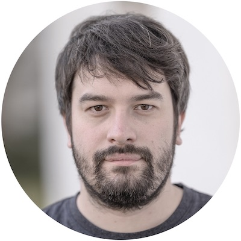

```{post} July 1, 2020
```

# Welcome to Martin Fleischmann

 The project is thrilled to welcome Martin Fleischmann as the postdoctoral researcher who will work with me (Dani) for the next two years of the Fellowship. Here is a quick bio of Martin:

> Martin Fleischmann is research associate in the Geographic Data Science Lab at the University of Liverpool and a member of the Urban Design Studies Unit at the University of Strathclyde. His research focuses on urban morphology and geographic data science focusing on quantitative analysis and classification of urban form, remote sensing and AI.

> He is the author of `momepy`, the open source urban morphology measuring toolkit for Python and member of development teams of GeoPandas, the open source Python package for geographic data and PySAL, the Python library for spatial analysis.

Martin brings with him a theoretical background in urban morphology combined with a _lot_ of experience in Python open source development around geospatial. There could not be a better combination for the project. As the postdoctoral researcher, Martin will be heavily involved in the implementation of much of the code required to develop the idea of Spatial Signatures, teach a computer to recognise them from satellite imagery, and use them to develop an Urban Grammar. At the same time, he is also joining the [Geographic Data Science Lab](https://www.liverpool.ac.uk/geographic-data-science/) and getting involved in its day to day life, participating in internal seminars, coordinating the Brown Bags series and, more generally, chipping in where possible to make the lab a great place to be part of. 

Welcome Martin, this will be a fun ride!